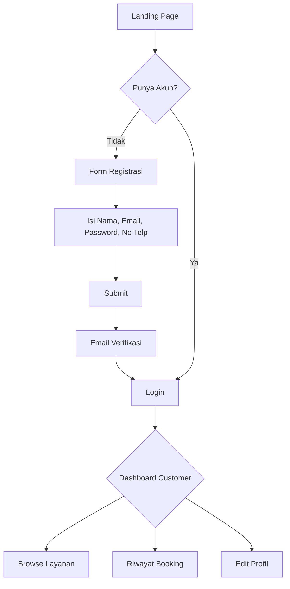
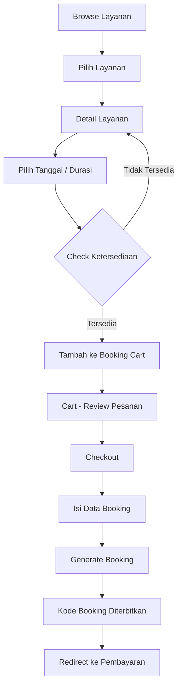
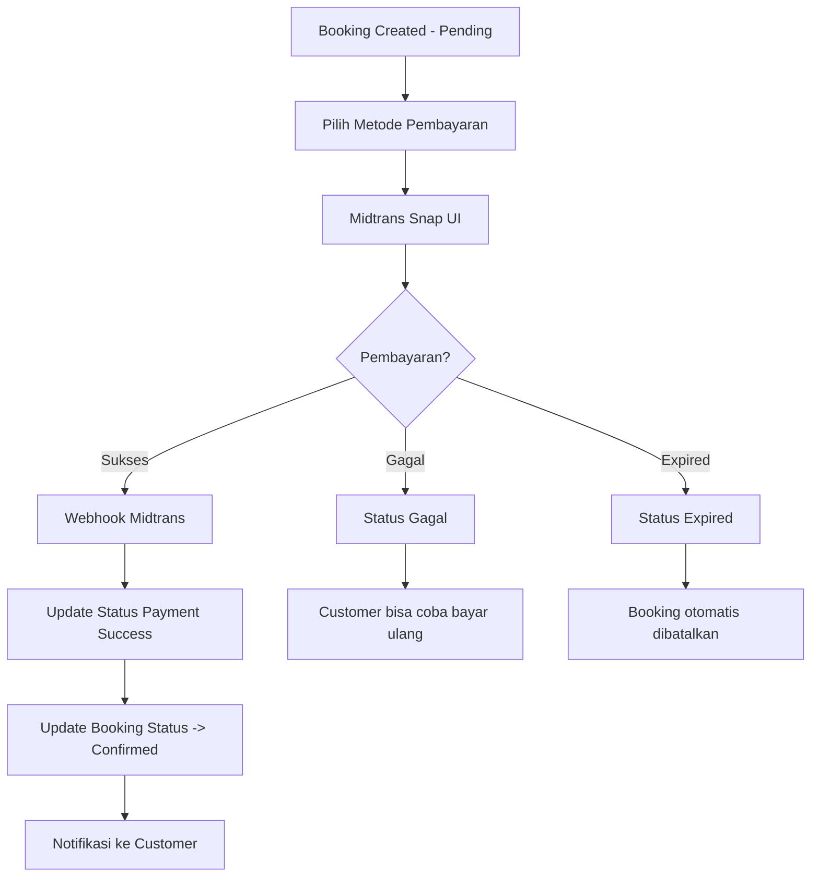
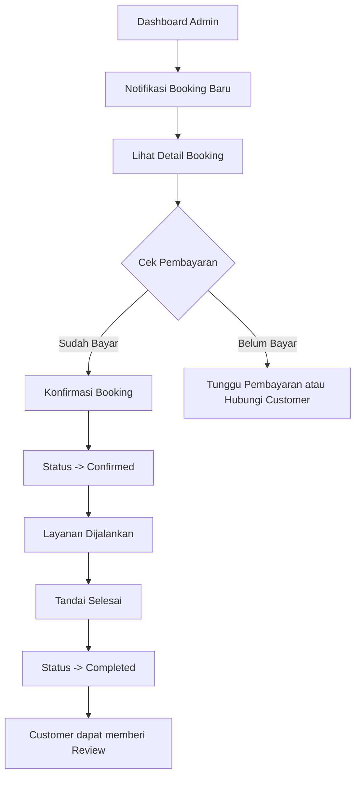
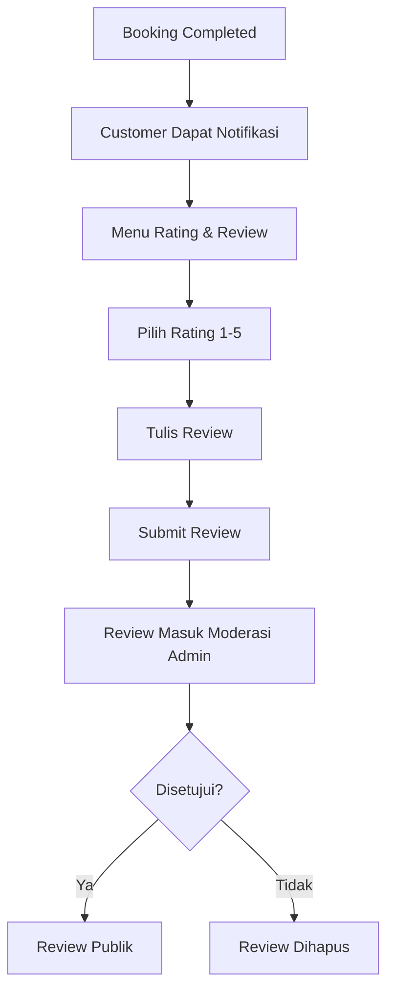
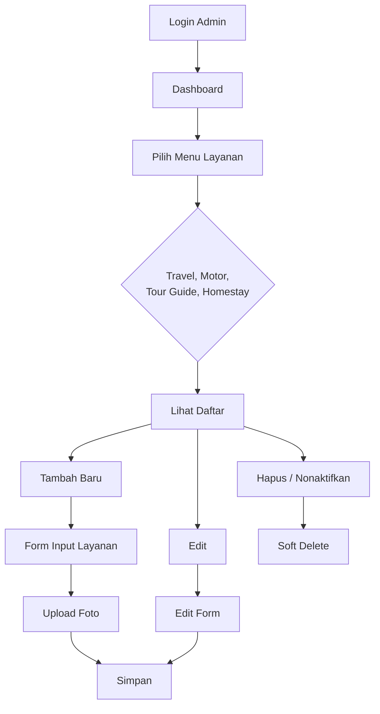
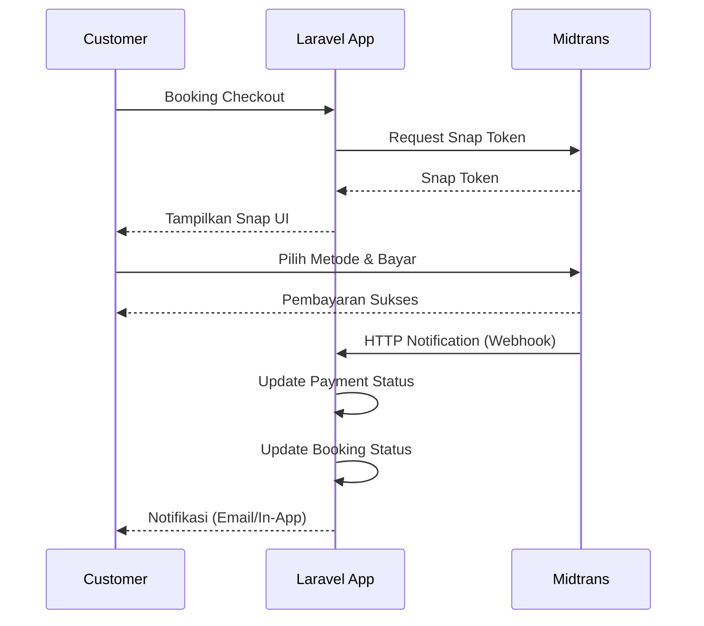

# Product Requirements Document (PRD)

## Sistem Website Booking Travel Terintegrasi

---

## Daftar Isi

1. [Pendahuluan](#1-pendahuluan)
2. [Tujuan Bisnis](#2-tujuan-bisnis)
3. [Aktor Sistem](#3-aktor-sistem)
4. [Fitur Customer](#4-fitur-customer)
5. [Fitur Admin Dashboard](#5-fitur-admin-dashboard)
6. [Alur Sistem](#6-alur-sistem)
7. [Arsitektur Teknis](#7-arsitektur-teknis)
8. [Kebutuhan Non-Fungsional](#8-kebutuhan-non-fungsional)

---

## 1. Pendahuluan

### 1.1 Latar Belakang

Bisnis travel booking saat ini menghadapi beberapa kendala signifikan:

- **Kesulitan melayani wisatawan asing** dalam memilih paket layanan seperti travel antar kota, rental motor, tour guide, dan homestay.
- **Keterbatasan pembayaran** yang masih dilakukan secara manual (transfer bank, cash), sehingga menyulitkan wisatawan asing yang tidak memiliki rekening lokal.
- **Tidak ada sistem terpusat** untuk mengelola pemesanan, pembayaran, dan ketersediaan layanan.
- **Sulitnya pelacakan** riwayat pemesanan dan pembayaran.

### 1.2 Ruang Lingkup

Sistem ini mencakup:

- Manajemen 4 jenis layanan: **Travel Packages**, **Motor Rentals**, **Tour Guides**, dan **Homestays**.
- Sistem pemesanan (booking) terintegrasi.
- Pembayaran online via Midtrans (support lokal & internasional).
- Dashboard admin untuk manajemen bisnis penuh.
- Sistem review & rating.

### 1.3 Definisi, Akronim, Singkatan

| Istilah | Definisi |
|---------|----------|
| Customer | Pelanggan yang melakukan pemesanan |
| Admin | Pengelola sistem dengan akses penuh |
| Booking | Transaksi pemesanan layanan |
| Midtrans | Payment gateway yang mendukung berbagai metode pembayaran |
| Snap | UI pembayaran dari Midtrans |
| Travel Package | Paket perjalanan antar kota/wisata |
| Motor Rental | Layanan sewa motor |
| Tour Guide | Layanan pemandu wisata |
| Homestay | Layanan penginapan |

---

## 2. Tujuan Bisnis

### 2.1 Tujuan Utama

1. **Mempermudah wisatawan** (lokal & asing) dalam memilih dan memesan layanan travel secara online.
2. **Menyediakan pembayaran multi-metode** yang support kartu kredit internasional, QRIS, virtual account, dan metode lokal lainnya melalui Midtrans.
3. **Meningkatkan efisiensi operasional** dengan sistem manajemen terpusat.
4. **Menyediakan dashboard analitik** untuk pengambilan keputusan bisnis.

### 2.2 Metrik Keberhasilan

- Waktu proses booking < 5 menit.
- Persentase pembayaran sukses > 90%.
- Admin dapat mengelola semua layanan dari satu dashboard.
- Sistem dapat menangani minimal 1000 booking per bulan.

---

## 3. Aktor Sistem

### 3.1 Customer (Pelanggan)

| Hak Akses | Deskripsi |
|-----------|-----------|
| Registrasi & Login | Mendaftar akun baru dan login |
| Browse Layanan | Melihat daftar semua layanan (travel, motor, tour guide, homestay) |
| Filter & Search | Mencari layanan berdasarkan filter |
| Detail Layanan | Melihat detail lengkap layanan |
| Booking | Melakukan pemesanan layanan |
| Pembayaran | Melakukan pembayaran booking via Midtrans |
| Riwayat Booking | Melihat riwayat dan status booking |
| Review & Rating | Memberikan ulasan setelah layanan selesai |
| Manajemen Profil | Mengedit data profil pribadi |

### 3.2 Admin

| Hak Akses | Deskripsi |
|-----------|-----------|
| Dashboard | Melihat ringkasan bisnis real-time |
| Manajemen Travel Package | CRUD paket travel |
| Manajemen Motor Rental | CRUD data motor rental |
| Manajemen Tour Guide | CRUD data tour guide |
| Manajemen Homestay | CRUD data homestay |
| Manajemen Booking | Lihat, konfirmasi, reschedule, cancel booking |
| Manajemen Pembayaran | Verifikasi manual, refund |
| Manajemen User | Lihat & kelola data customer |
| Manajemen Review | Moderasi review |
| Laporan Keuangan | Laporan pendapatan per periode |
| Pengaturan Sistem | Konfigurasi umum sistem |

---

## 4. Fitur Customer

### 4.1 Manajemen Akun

| Fitur | Deskripsi |
|-------|-----------|
| Registrasi | Mendaftar dengan nama, email, password, no telepon |
| Login | Login dengan email & password |
| Logout | Keluar dari sesi |
| Lupa Password | Reset password via email |
| Edit Profil | Mengubah nama, no telepon, avatar, alamat, kewarganegaraan |
| Ubah Password | Mengganti password |

### 4.2 Browse & Cari Layanan

| Fitur | Deskripsi |
|-------|-----------|
| Halaman Utama | Menampilkan semua kategori layanan |
| Halaman Travel Package | Daftar paket travel dengan filter (origin, destinasi, tanggal, harga) |
| Halaman Motor Rental | Daftar motor dengan filter (tipe, harga, ketersediaan) |
| Halaman Tour Guide | Daftar tour guide dengan filter (bahasa, spesialisasi, harga) |
| Halaman Homestay | Daftar homestay dengan filter (kota, harga, fasilitas) |
| Detail Layanan | Informasi lengkap, foto, harga, deskripsi, ketersediaan |
| Search Global | Pencarian teks di semua layanan |

### 4.3 Booking & Checkout

| Fitur | Deskripsi |
|-------|-----------|
| Pilih Layanan | Memilih layanan dan menentukan quantity / durasi |
| Pilih Tanggal | Memilih tanggal booking (sesuai ketersediaan) |
| Booking Cart | Menampilkan ringkasan pesanan sebelum checkout |
| Apply Promo | Input kode promo (future scope) |
| Checkout | Mengirim data booking ke sistem |
| Booking Confirmation | Mendapatkan kode booking unik |

### 4.4 Pembayaran

| Fitur | Deskripsi |
|-------|-----------|
| Pilih Metode Pembayaran | Menampilkan metode via Midtrans Snap |
| Bayar via Midtrans | Redirect ke Snap UI Midtrans |
| Status Pembayaran | Update otomatis saat pembayaran sukses/gagal/expired |
| Riwayat Pembayaran | Melihat status pembayaran per booking |
| Invoice Download | Download PDF invoice (future scope) |

### 4.5 Review & Rating

| Fitur | Deskripsi |
|-------|-----------|
| Beri Review | Memberi rating (1-5) dan ulasan teks setelah booking selesai |
| Upload Foto Review | Menambahkan foto ke review (future scope) |
| Edit Review | Mengedit review yang sudah dibuat |

### 4.6 Riwayat Booking

| Fitur | Deskripsi |
|-------|-----------|
| Daftar Booking | Semua booking yang pernah dibuat |
| Status Booking | Melihat status: pending, confirmed, completed, cancelled |
| Detail Booking | Informasi lengkap booking dan pembayaran |

---

## 5. Fitur Admin Dashboard

### 5.1 Dashboard Utama

| Fitur | Deskripsi |
|-------|-----------|
| Statistik Ringkasan | Total booking, pendapatan, user aktif, layanan terpopuler |
| Grafik Pendapatan | Grafik pendapatan harian/mingguan/bulanan |
| Booking Terbaru | 10 booking terbaru dengan status |
| Notifikasi | Booking baru, pembayaran tertunda |

### 5.2 Manajemen Travel Package

| Fitur | Deskripsi |
|-------|-----------|
| Lihat Semua Paket | Data table dengan pagination, search, filter |
| Tambah Paket Baru | Form input: nama, origin, destination, description, price, max_pax, itinerary, foto |
| Edit Paket | Mengubah data paket |
| Hapus Paket | Soft delete paket |
| Atur Status | Aktif / non-aktifkan paket |

### 5.3 Manajemen Motor Rental

| Fitur | Deskripsi |
|-------|-----------|
| Lihat Semua Motor | Data table motor |
| Tambah Motor | Form: tipe motor, brand, plate_number, price_per_day, insurance_price, foto |
| Edit Motor | Mengubah data motor |
| Hapus Motor | Soft delete motor |
| Atur Ketersediaan | Tandai motor tersedia / disewa |

### 5.4 Manajemen Tour Guide

| Fitur | Deskripsi |
|-------|-----------|
| Lihat Semua Guide | Data table guide |
| Tambah Guide | Form: nama, bio, languages, specialties, price_per_day, max_pax, foto |
| Edit Guide | Mengubah data guide |
| Hapus Guide | Soft delete guide |
| Atur Ketersediaan | Jadwal guide available / booked |

### 5.5 Manajemen Homestay

| Fitur | Deskripsi |
|-------|-----------|
| Lihat Semua Homestay | Data table homestay |
| Tambah Homestay | Form: nama, address, city, total_rooms, price_per_night, facilities, foto |
| Edit Homestay | Mengubah data homestay |
| Hapus Homestay | Soft delete homestay |
| Atur Ketersediaan Room | Manage jumlah kamar tersedia per tanggal |

### 5.6 Manajemen Booking

| Fitur | Deskripsi |
|-------|-----------|
| Lihat Semua Booking | Data table booking dengan filter status, tanggal, layanan |
| Detail Booking | Informasi lengkap customer, layanan, pembayaran |
| Konfirmasi Booking | Mengubah status pending -> confirmed |
| Tandai Selesai | Mengubah status confirmed -> completed |
| Cancel Booking | Membatalkan booking (dengan alasan) |
| Export Data | Export booking ke CSV/Excel (future scope) |

### 5.7 Manajemen Pembayaran

| Fitur | Deskripsi |
|-------|-----------|
| Lihat Semua Pembayaran | Data table semua transaksi |
| Detail Pembayaran | Informasi lengkap dari Midtrans |
| Verifikasi Manual | Untuk pembayaran manual (jika ada) |
| Refund | Proses refund pembayaran |

### 5.8 Manajemen User

| Fitur | Deskripsi |
|-------|-----------|
| Lihat Semua User | Data table user |
| Detail User | Informasi lengkap dan riwayat booking user |
| Nonaktifkan User | Suspend akun user |

### 5.9 Manajemen Review

| Fitur | Deskripsi |
|-------|-----------|
| Lihat Semua Review | Data table review per layanan |
| Approve Review | Publikasikan review |
| Hapus Review | Hapus review yang melanggar |

### 5.10 Laporan Keuangan

| Fitur | Deskripsi |
|-------|-----------|
| Laporan Harian | Pendapatan per hari |
| Laporan Bulanan | Pendapatan per bulan |
| Laporan Per Layanan | Pendapatan per jenis layanan |
| Filter Periode | Filter tanggal kustom |
| Export | Export data ke format PDF/CSV (future scope) |

### 5.11 Pengaturan Sistem

| Fitur | Deskripsi |
| Profil Admin | Edit profil admin |
| Pengaturan Website | Nama website, logo, kontak, sosial media |
| Pengaturan Pembayaran | Konfigurasi Midtrans (Server Key, Client Key, Environment) |

---

## 6. Alur Sistem

### 6.1 Alur Registrasi & Login Customer



### 6.2 Alur Booking & Checkout



### 6.3 Alur Pembayaran Midtrans



### 6.4 Alur Admin Konfirmasi Booking



### 6.5 Alur Review & Rating



### 6.6 Alur Admin Kelola Layanan



---

## 7. Arsitektur Teknis

### 7.1 Tech Stack

| Layer | Teknologi | Versi |
|-------|-----------|-------|
| Backend Framework | Laravel | 13.x |
| Frontend Framework | React | 19.x |
| Server-side Rendering | Inertia.js | v3 |
| CSS Framework | Tailwind CSS | 4.x |
| Database | MySQL | 8.x |
| Payment Gateway | Midtrans Snap | - |
| Auth Scaffolding | Laravel Breeze (React + Inertia) | - |
| Build Tool | Vite | - |
| TypeScript | Yes | - |
| Code Style | Laravel Pint, ESLint, Prettier | - |

### 7.2 Struktur Direktori

```
app/
├── Http/
│   ├── Controllers/
│   │   ├── Admin/
│   │   │   ├── DashboardController.php
│   │   │   ├── TravelPackageController.php
│   │   │   ├── MotorRentalController.php
│   │   │   ├── TourGuideController.php
│   │   │   ├── HomestayController.php
│   │   │   ├── BookingController.php
│   │   │   ├── PaymentController.php
│   │   │   ├── UserController.php
│   │   │   ├── ReviewController.php
│   │   │   └── ReportController.php
│   │   ├── Customer/
│   │   │   ├── BookingController.php
│   │   │   ├── PaymentController.php
│   │   │   └── ReviewController.php
│   │   └── Controller.php
│   ├── Middleware/
│   │   ├── HandleInertiaRequests.php
│   │   └── AdminMiddleware.php
│   └── Requests/
│       ├── StoreTravelPackageRequest.php
│       ├── StoreMotorRentalRequest.php
│       ├── StoreTourGuideRequest.php
│       ├── StoreHomestayRequest.php
│       └── StoreBookingRequest.php
├── Models/
│   ├── User.php
│   ├── TravelPackage.php
│   ├── MotorRental.php
│   ├── TourGuide.php
│   ├── Homestay.php
│   ├── Booking.php
│   ├── BookingItem.php
│   ├── Payment.php
│   ├── Review.php
│   └── Media.php
├── Services/
│   ├── MidtransService.php
│   └── BookingService.php
├── Enums/
│   ├── BookingStatus.php
│   └── PaymentStatus.php
└── Notifications/
    └── BookingConfirmed.php

resources/js/
├── pages/
│   ├── welcome.tsx
│   ├── auth/              # Breeze generates
│   ├── customer/
│   │   ├── Dashboard.tsx
│   │   ├── Bookings.tsx
│   │   ├── BookingDetail.tsx
│   │   └── Reviews.tsx
│   ├── services/
│   │   ├── TravelPackages.tsx
│   │   ├── TravelPackageDetail.tsx
│   │   ├── MotorRentals.tsx
│   │   ├── MotorRentalDetail.tsx
│   │   ├── TourGuides.tsx
│   │   └── TourGuideDetail.tsx
│   │   └── Homestays.tsx
│   │   └── HomestayDetail.tsx
│   ├── booking/
│   │   ├── Cart.tsx
│   │   └── Checkout.tsx
│   ├── payment/
│   │   └── PaymentProcess.tsx
│   └── admin/
│       ├── Dashboard.tsx
│       ├── TravelPackages/
│       ├── MotorRentals/
│       ├── TourGuides/
│       ├── Homestays/
│       ├── Bookings/
│       ├── Payments/
│       ├── Users/
│       ├── Reviews/
│       └── Reports/
├── components/
│   ├── ui/                # UI primitives
│   ├── layout/
│   │   ├── AppLayout.tsx
│   │   ├── AdminLayout.tsx
│   │   └── GuestLayout.tsx
│   └── shared/
└── types/
    ├── auth.ts
    ├── booking.ts
    ├── service.ts
    ├── payment.ts
    └── index.ts

routes/
├── web.php
├── admin.php
└── auth.php              # Breeze generates
```

### 7.3 Alur Data Pembayaran Midtrans



---

## 8. Kebutuhan Non-Fungsional

### 8.1 Keamanan

- CSRF protection aktif.
- SQL Injection prevention via Eloquent ORM.
- XSS protection via Inertia + React.
- Semua password di-hash menggunakan bcrypt.
- Midtrans signature verification untuk webhook.
- Role-based access control (Customer vs Admin).
- HTTPS untuk semua koneksi.

### 8.2 Performa

- Lazy loading untuk gambar layanan.
- Pagination untuk semua daftar (backend + frontend).
- Optimasi query dengan eager loading.
- Caching untuk data statis (daftar layanan).
- Deferred props Inertia untuk data berat.

### 8.3 Skalabilitas

- Arsitektur siap untuk penambahan tipe layanan baru.
- Database indexing pada kolom yang sering di-query.
- Queue untuk proses background (notifikasi, webhook).

### 8.4 SEO

- SSR via Inertia untuk halaman publik.
- Meta tags dinamis per halaman.
- Sitemap untuk halaman layanan.

### 8.5 Penggunaan

- UI responsif (mobile-first dengan Tailwind).
- Loading skeleton untuk deferred props.
- Error handling dengan pesan yang user-friendly.
- Validasi form client-side + server-side.
