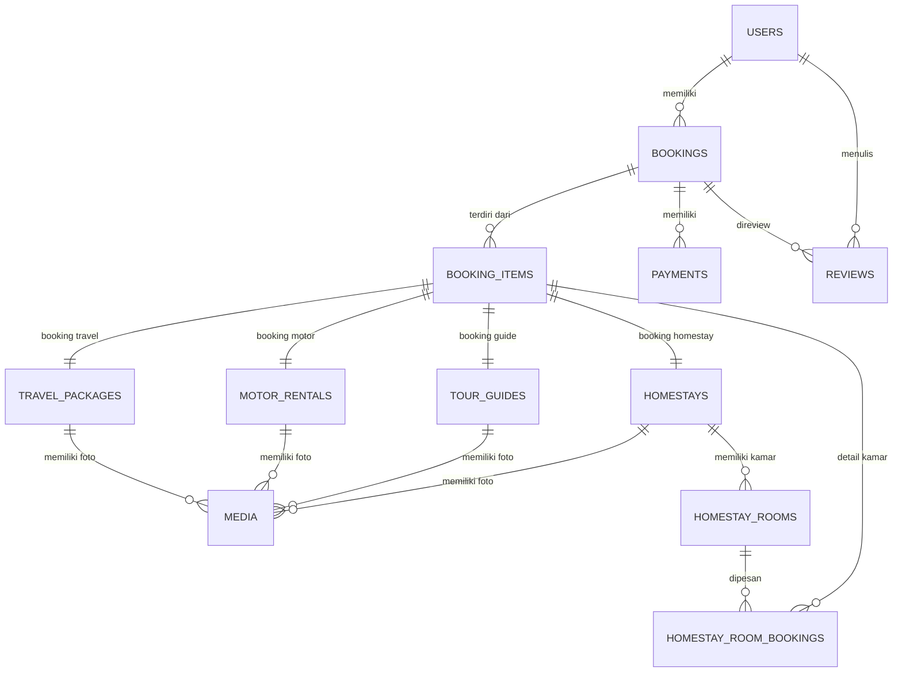

# Database Schema Design

## Sistem Website Booking Travel Terintegrasi

---

## Entity Relationship Diagram (ERD)

---

## Definisi Tabel

### 1. `users`

Tabel master pengguna sistem (customer dan admin). Extends dari tabel `users` default Laravel.

| Kolom | Tipe Data | Keterangan |
|-------|-----------|------------|
| id | bigint unsigned, PK, auto_increment | Identitas unik |
| name | varchar(255) | Nama lengkap |
| email | varchar(255), unique | Email (untuk login) |
| email_verified_at | timestamp, nullable | Waktu verifikasi email |
| password | varchar(255) | Password (hash bcrypt) |
| role | enum('customer','admin'), default 'customer' | Role pengguna |
| phone | varchar(20), nullable | Nomor telepon |
| avatar | varchar(255), nullable | URL foto profil |
| address | text, nullable | Alamat lengkap |
| nationality | varchar(100), nullable | Kewarganegaraan |
| currency_preference | varchar(10), default 'IDR' | Preferensi mata uang |
| is_active | boolean, default true | Status aktif akun |
| remember_token | varchar(100), nullable | Token remember me |
| created_at | timestamp | Waktu dibuat |
| updated_at | timestamp | Waktu diupdate |

**Index:**
- PRIMARY KEY (`id`)
- UNIQUE KEY `users_email_unique` (`email`)
- INDEX `users_role_index` (`role`)

**Relasi:**
- One-to-many ke `bookings` (user_id)
- One-to-many ke `reviews` (user_id)

---

### 2. `travel_packages`

Layanan paket perjalanan wisata.

| Kolom | Tipe Data | Keterangan |
|-------|-----------|------------|
| id | bigint unsigned, PK, auto_increment | Identitas unik |
| name | varchar(255) | Nama paket travel |
| slug | varchar(255), unique | Slug untuk URL |
| origin | varchar(255) | Kota asal keberangkatan |
| destination | varchar(255) | Kota tujuan |
| description | text | Deskripsi paket |
| itinerary | json | Rincian itinerary (hari per hari) |
| price | decimal(15,2) | Harga per orang |
| max_pax | int | Kapasitas maksimal per booking |
| duration_days | int | Lama perjalanan (hari) |
| includes | text, nullable | Fasilitas termasuk |
| excludes | text, nullable | Fasilitas tidak termasuk |
| is_active | boolean, default true | Status aktif |
| created_at | timestamp | Waktu dibuat |
| updated_at | timestamp | Waktu diupdate |
| deleted_at | timestamp, nullable | Soft delete |

**Index:**
- PRIMARY KEY (`id`)
- UNIQUE KEY `travel_packages_slug_unique` (`slug`)
- INDEX `travel_packages_is_active_index` (`is_active`)

**Relasi:**
- One-to-many polymorphic ke `media` (sebagai `mediable`)
- One-to-many polymorphic ke `booking_items` (sebagai `bookable`)

---

### 3. `motor_rentals`

Layanan sewa motor.

| Kolom | Tipe Data | Keterangan |
|-------|-----------|------------|
| id | bigint unsigned, PK, auto_increment | Identitas unik |
| name | varchar(255) | Nama/jenis motor |
| slug | varchar(255), unique | Slug untuk URL |
| brand | varchar(255) | Merek motor (Honda, Yamaha, dll) |
| motor_type | varchar(255) | Tipe motor (Matic, Bebek, Sport) |
| plate_number | varchar(50) | Nomor plat kendaraan |
| description | text | Deskripsi motor |
| price_per_day | decimal(15,2) | Harga sewa per hari |
| insurance_price | decimal(15,2), default 0 | Harga asuransi opsional |
| cc | int, nullable | Kapasitas mesin (cc) |
| transmission | enum('manual','matic'), nullable | Transmisi |
| is_active | boolean, default true | Status aktif |
| created_at | timestamp | Waktu dibuat |
| updated_at | timestamp | Waktu diupdate |
| deleted_at | timestamp, nullable | Soft delete |

**Index:**
- PRIMARY KEY (`id`)
- UNIQUE KEY `motor_rentals_slug_unique` (`slug`)
- INDEX `motor_rentals_is_active_index` (`is_active`)
- INDEX `motor_rentals_brand_index` (`brand`)

**Relasi:**
- One-to-many polymorphic ke `media` (sebagai `mediable`)
- One-to-many polymorphic ke `booking_items` (sebagai `bookable`)

---

### 4. `tour_guides`

Layanan pemandu wisata.

| Kolom | Tipe Data | Keterangan |
|-------|-----------|------------|
| id | bigint unsigned, PK, auto_increment | Identitas unik |
| name | varchar(255) | Nama tour guide |
| slug | varchar(255), unique | Slug untuk URL |
| bio | text | Biografi / deskripsi |
| languages | json | Bahasa yang dikuasai (array) |
| specialties | json | Spesialisasi (array: hiking, city tour, dll) |
| price_per_day | decimal(15,2) | Harga per hari |
| max_pax | int | Kapasitas maksimal per tour |
| phone | varchar(20), nullable | Nomor telepon guide |
| is_active | boolean, default true | Status aktif |
| created_at | timestamp | Waktu dibuat |
| updated_at | timestamp | Waktu diupdate |
| deleted_at | timestamp, nullable | Soft delete |

**Index:**
- PRIMARY KEY (`id`)
- UNIQUE KEY `tour_guides_slug_unique` (`slug`)
- INDEX `tour_guides_is_active_index` (`is_active`)

**Relasi:**
- One-to-many polymorphic ke `media` (sebagai `mediable`)
- One-to-many polymorphic ke `booking_items` (sebagai `bookable`)

---

### 5. `homestays`

Layanan penginapan homestay.

| Kolom | Tipe Data | Keterangan |
|-------|-----------|------------|
| id | bigint unsigned, PK, auto_increment | Identitas unik |
| name | varchar(255) | Nama homestay |
| slug | varchar(255), unique | Slug untuk URL |
| description | text | Deskripsi homestay |
| address | text | Alamat lengkap |
| city | varchar(255) | Kota |
| latitude | decimal(10,8), nullable | Koordinat latitude |
| longitude | decimal(11,8), nullable | Koordinat longitude |
| facilities | json | Fasilitas (array: wifi, ac, parking, dll) |
| rules | text, nullable | Aturan homestay |
| check_in_time | time, default '14:00:00' | Waktu check-in |
| check_out_time | time, default '12:00:00' | Waktu check-out |
| is_active | boolean, default true | Status aktif |
| created_at | timestamp | Waktu dibuat |
| updated_at | timestamp | Waktu diupdate |
| deleted_at | timestamp, nullable | Soft delete |

**Index:**
- PRIMARY KEY (`id`)
- UNIQUE KEY `homestays_slug_unique` (`slug`)
- INDEX `homestays_city_index` (`city`)
- INDEX `homestays_is_active_index` (`is_active`)

**Relasi:**
- One-to-many ke `homestay_rooms` (id)
- One-to-many polymorphic ke `media` (sebagai `mediable`)
- One-to-many polymorphic ke `booking_items` (sebagai `bookable`)

---

### 6. `homestay_rooms`

Detail kamar per homestay.

| Kolom | Tipe Data | Keterangan |
|-------|-----------|------------|
| id | bigint unsigned, PK, auto_increment | Identitas unik |
| homestay_id | bigint unsigned, FK | ID homestay |
| name | varchar(255) | Nama kamar (Deluxe, Standard, dll) |
| description | text, nullable | Deskripsi kamar |
| price_per_night | decimal(15,2) | Harga per malam |
| max_guests | int | Kapasitas maksimal tamu |
| total_rooms | int | Jumlah kamar tersedia |
| facilities | json, nullable | Fasilitas kamar |
| size_sqm | decimal(8,2), nullable | Luas kamar (m²) |
| is_active | boolean, default true | Status aktif |
| created_at | timestamp | Waktu dibuat |
| updated_at | timestamp | Waktu diupdate |
| deleted_at | timestamp, nullable | Soft delete |

**Index:**
- PRIMARY KEY (`id`)
- INDEX `homestay_rooms_homestay_id_index` (`homestay_id`)
- INDEX `homestay_rooms_is_active_index` (`is_active`)

**Foreign Key:**
- `homestay_id` REFERENCES `homestays(id)` ON DELETE CASCADE

**Relasi:**
- Many-to-one ke `homestays` (homestay_id)
- One-to-many ke `homestay_room_bookings` (id)
- One-to-many polymorphic ke `media` (sebagai `mediable`)

---

### 7. `bookings`

Transaksi pemesanan utama.

| Kolom | Tipe Data | Keterangan |
|-------|-----------|------------|
| id | bigint unsigned, PK, auto_increment | Identitas unik |
| booking_code | varchar(50), unique | Kode booking unik (generated: BK-XXXXXX) |
| user_id | bigint unsigned, FK | ID customer yang booking |
| total_amount | decimal(15,2) | Total harga (sebelum diskon) |
| discount_amount | decimal(15,2), default 0.00 | Nilai diskon (future) |
| final_amount | decimal(15,2) | Total akhir yang harus dibayar |
| status | enum('pending','confirmed','completed','cancelled'), default 'pending' | Status booking |
| notes | text, nullable | Catatan customer |
| admin_notes | text, nullable | Catatan admin (internal) |
| cancellation_reason | text, nullable | Alasan pembatalan |
| confirmed_at | timestamp, nullable | Waktu dikonfirmasi |
| completed_at | timestamp, nullable | Waktu selesai |
| cancelled_at | timestamp, nullable | Waktu dibatalkan |
| created_at | timestamp | Waktu dibuat |
| updated_at | timestamp | Waktu diupdate |

**Index:**
- PRIMARY KEY (`id`)
- UNIQUE KEY `bookings_booking_code_unique` (`booking_code`)
- INDEX `bookings_user_id_index` (`user_id`)
- INDEX `bookings_status_index` (`status`)
- INDEX `bookings_created_at_index` (`created_at`)

**Foreign Key:**
- `user_id` REFERENCES `users(id)` ON DELETE CASCADE

**Relasi:**
- Many-to-one ke `users` (user_id)
- One-to-many ke `booking_items` (booking_id)
- One-to-many ke `payments` (booking_id)
- One-to-many ke `reviews` (booking_id)

---

### 8. `booking_items`

Detail item per booking. Menggunakan polymorphic relationship untuk mendukung multi-tipe layanan.

| Kolom | Tipe Data | Keterangan |
|-------|-----------|------------|
| id | bigint unsigned, PK, auto_increment | Identitas unik |
| booking_id | bigint unsigned, FK | ID booking |
| bookable_type | varchar(255) | Nama model (TravelPackage, MotorRental, TourGuide, Homestay) |
| bookable_id | bigint unsigned | ID dari model terkait |
| quantity | int, default 1 | Jumlah (pax/hari/kamar) |
| unit_price | decimal(15,2) | Harga satuan saat booking |
| subtotal | decimal(15,2) | Total per item (qty x unit_price) |
| date_from | date | Tanggal mulai |
| date_to | date, nullable | Tanggal selesai (jika > 1 hari) |
| notes | text, nullable | Catatan per item |
| created_at | timestamp | Waktu dibuat |
| updated_at | timestamp | Waktu diupdate |

**Index:**
- PRIMARY KEY (`id`)
- INDEX `booking_items_booking_id_index` (`booking_id`)
- INDEX `booking_items_bookable_index` (`bookable_type`, `bookable_id`)

**Foreign Key:**
- `booking_id` REFERENCES `bookings(id)` ON DELETE CASCADE

**Relasi:**
- Many-to-one ke `bookings` (booking_id)
- Polymorphic many-to-one ke model layanan (`bookable_type`, `bookable_id`)
- One-to-many ke `homestay_room_bookings` (jika bookable_type = Homestay)

---

### 9. `homestay_room_bookings`

Detail kamar spesifik dalam booking homestay. Dipisah karena satu booking homestay bisa include beberapa kamar dengan tipe berbeda.

| Kolom | Tipe Data | Keterangan |
|-------|-----------|------------|
| id | bigint unsigned, PK, auto_increment | Identitas unik |
| booking_item_id | bigint unsigned, FK | ID booking item (homestay) |
| homestay_room_id | bigint unsigned, FK | ID kamar homestay |
| quantity | int | Jumlah kamar |
| unit_price | decimal(15,2) | Harga satuan per malam |
| subtotal | decimal(15,2) | Total per kamar |
| nights | int | Jumlah malam |
| check_in | date | Tanggal check-in |
| check_out | date | Tanggal check-out |
| created_at | timestamp | Waktu dibuat |
| updated_at | timestamp | Waktu diupdate |

**Index:**
- PRIMARY KEY (`id`)
- INDEX `hs_room_booking_item_id_index` (`booking_item_id`)
- INDEX `hs_room_booking_room_id_index` (`homestay_room_id`)

**Foreign Key:**
- `booking_item_id` REFERENCES `booking_items(id)` ON DELETE CASCADE
- `homestay_room_id` REFERENCES `homestay_rooms(id)` ON DELETE CASCADE

---

### 10. `payments`

Riwayat pembayaran booking. Satu booking bisa memiliki beberapa payment record (retry, partial refund, dll).

| Kolom | Tipe Data | Keterangan |
|-------|-----------|------------|
| id | bigint unsigned, PK, auto_increment | Identitas unik |
| booking_id | bigint unsigned, FK | ID booking |
| payment_code | varchar(100), unique | Kode unik pembayaran internal |
| midtrans_transaction_id | varchar(255), nullable | Transaction ID dari Midtrans |
| midtrans_order_id | varchar(255), nullable | Order ID dari Midtrans |
| gross_amount | decimal(15,2) | Jumlah pembayaran |
| status | enum('pending','success','failed','expired','refund'), default 'pending' | Status pembayaran |
| payment_method | varchar(255), nullable | Metode pembayaran (credit_card, bank_transfer, gopay, qris, dll) |
| payment_channel | varchar(255), nullable | Channel spesifik (BCA, Mandiri, BRI, dll) |
| transaction_time | datetime, nullable | Waktu transaksi dari Midtrans |
| fraud_status | varchar(50), nullable | Status fraud dari Midtrans (accept, deny, challenge) |
| raw_response | json, nullable | Full response dari Midtrans |
| paid_at | timestamp, nullable | Waktu pembayaran sukses |
| expired_at | timestamp, nullable | Waktu expired pembayaran |
| refunded_at | timestamp, nullable | Waktu refund |
| refund_amount | decimal(15,2), default 0.00 | Jumlah refund |
| notes | text, nullable | Catatan admin |
| created_at | timestamp | Waktu dibuat |
| updated_at | timestamp | Waktu diupdate |

**Index:**
- PRIMARY KEY (`id`)
- UNIQUE KEY `payments_payment_code_unique` (`payment_code`)
- INDEX `payments_booking_id_index` (`booking_id`)
- INDEX `payments_midtrans_transaction_id_index` (`midtrans_transaction_id`)
- INDEX `payments_status_index` (`status`)

**Foreign Key:**
- `booking_id` REFERENCES `bookings(id)` ON DELETE CASCADE

---

### 11. `reviews`

Ulasan dari customer setelah booking completed.

| Kolom | Tipe Data | Keterangan |
|-------|-----------|------------|
| id | bigint unsigned, PK, auto_increment | Identitas unik |
| user_id | bigint unsigned, FK | ID customer |
| booking_id | bigint unsigned, FK | ID booking |
| rating | tinyint unsigned | Rating (1-5) |
| review_text | text | Isi ulasan |
| is_approved | boolean, default false | Status moderasi admin |
| approved_at | timestamp, nullable | Waktu disetujui |
| created_at | timestamp | Waktu dibuat |
| updated_at | timestamp | Waktu diupdate |
| deleted_at | timestamp, nullable | Soft delete |

**Index:**
- PRIMARY KEY (`id`)
- INDEX `reviews_user_id_index` (`user_id`)
- INDEX `reviews_booking_id_index` (`booking_id`)
- UNIQUE KEY `reviews_booking_user_unique` (`booking_id`, `user_id`)
- INDEX `reviews_is_approved_index` (`is_approved`)

**Foreign Key:**
- `user_id` REFERENCES `users(id)` ON DELETE CASCADE
- `booking_id` REFERENCES `bookings(id)` ON DELETE CASCADE

**Constraint:**
- `rating` BETWEEN 1 AND 5

---

### 12. `media`

Tabel polymorphic untuk foto/gambar layanan.

| Kolom | Tipe Data | Keterangan |
|-------|-----------|------------|
| id | bigint unsigned, PK, auto_increment | Identitas unik |
| mediable_type | varchar(255) | Nama model (TravelPackage, MotorRental, TourGuide, Homestay, HomestayRoom) |
| mediable_id | bigint unsigned | ID dari model terkait |
| url | varchar(255) | URL file gambar |
| path | varchar(255) | Path file di storage |
| disk | varchar(50), default 'public' | Storage disk |
| mime_type | varchar(50), nullable | Tipe file (image/jpeg, image/png) |
| size | int, nullable | Ukuran file (bytes) |
| is_primary | boolean, default false | Foto utama / thumbnail |
| sort_order | int, default 0 | Urutan tampilan |
| created_at | timestamp | Waktu dibuat |
| updated_at | timestamp | Waktu diupdate |

**Index:**
- PRIMARY KEY (`id`)
- INDEX `media_mediable_index` (`mediable_type`, `mediable_id`)

---

## Ringkasan Relasi

| Tabel | Relasi | Tabel Terkait |
|-------|--------|---------------|
| users | 1:N | bookings, reviews |
| travel_packages | 1:N (poly) | booking_items, media |
| motor_rentals | 1:N (poly) | booking_items, media |
| tour_guides | 1:N (poly) | booking_items, media |
| homestays | 1:N | homestay_rooms |
| homestays | 1:N (poly) | booking_items, media |
| homestay_rooms | 1:N | homestay_room_bookings |
| homestay_rooms | 1:N (poly) | media |
| bookings | N:1 | users |
| bookings | 1:N | booking_items, payments, reviews |
| booking_items | N:1 | bookings |
| booking_items | N:1 (poly) | travel_packages, motor_rentals, tour_guides, homestays |
| booking_items | 1:N | homestay_room_bookings |
| payments | N:1 | bookings |
| reviews | N:1 | users, bookings |
| media | N:1 (poly) | travel_packages, motor_rentals, tour_guides, homestays, homestay_rooms |

---

## Notes Implementasi

### Enum / Status

**Booking Status:**
- `pending` — Menunggu pembayaran
- `confirmed` — Pembayaran sukses & dikonfirmasi admin
- `completed` — Layanan telah selesai
- `cancelled` — Dibatalkan (oleh customer atau admin)

**Payment Status:**
- `pending` — Menunggu pembayaran
- `success` — Pembayaran berhasil
- `failed` — Pembayaran gagal
- `expired` — Waktu pembayaran habis
- `refund` — Pembayaran sudah direfund

### Polymorphic Mapping

| `bookable_type` / `mediable_type` | Model |
|------------------------------------|-------|
| `App\Models\TravelPackage` | TravelPackage |
| `App\Models\MotorRental` | MotorRental |
| `App\Models\TourGuide` | TourGuide |
| `App\Models\Homestay` | Homestay |
| `App\Models\HomestayRoom` | HomestayRoom (media only) |

### Auto-generate Booking Code

Format: `BK-XXXXXXXX` (8 karakter alfanumerik unik)

Contoh: `BK-A3F8K2M1`

### Indexing Strategy

- **High cardinality** (unique): email, slug, booking_code, payment_code
- **Medium cardinality** (filter): status, role, city, brand, is_active
- **Foreign keys**: semua kolom FK di-index
- **Polymorphic**: composite index pada `(type, id)` pairs
- **Temporal**: created_at untuk laporan per periode
